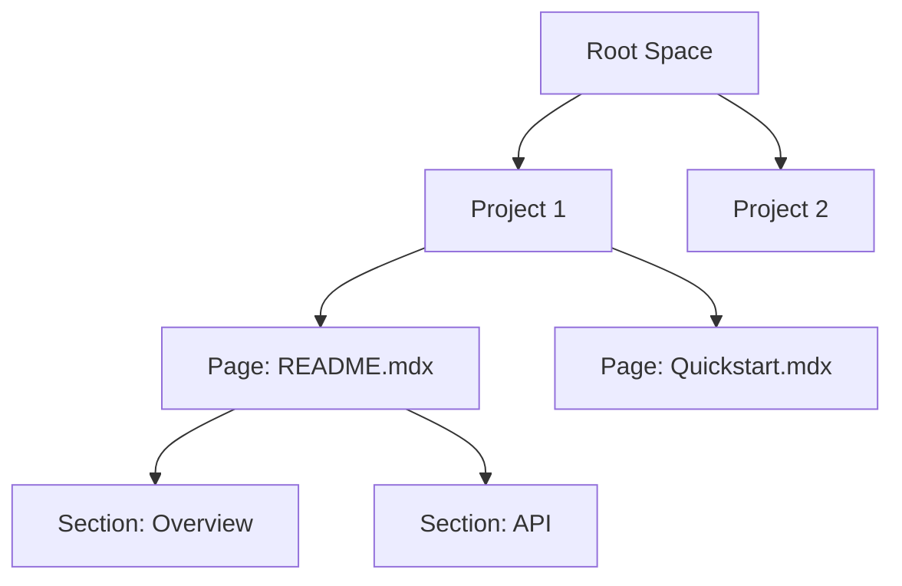

## Overview

Behruz Toshpulatov provides a flexible documentation space where you organize project docs hierarchically. Grasp these core concepts to structure content effectively, streamline workflows, and integrate with tools. Master the hierarchy, project management flow, integrations, and best practices to build scalable documentation.

<Columns cols={3}>
  <Card title="Hierarchy" icon="layers" href="#documentation-space-hierarchy">
    Organize docs in nested spaces and pages.
  </Card>
  <Card title="Workflow" icon="git-branch" href="#workflow-for-managing-projects">
    Follow steps to create, edit, and publish.
  </Card>
  <Card title="Integrations" icon="plug" href="#integration-with-external-tools">
    Connect GitHub, Slack, and more.
  </Card>
</Columns>

## Documentation Space Hierarchy

Your documentation follows a tree-like structure: spaces contain projects, projects contain pages, and pages support nested sections. This hierarchy enables intuitive navigation.



<Expandable title="Advanced Hierarchy Options" default-open="false">

Customize with custom slugs and permissions. Use YAML frontmatter for metadata:

````yaml
title: My Page
description: Custom page details
tags: ["core", "api"]
````

</Expandable>

## Workflow for Managing Projects

Follow this sequential process to manage docs efficiently.

<Steps>
  <Step title="Create Space" icon="plus">
    Start a new documentation space for your project.
  </Step>
  <Step title="Add Projects" icon="folder">
    Create project folders within the space.
  </Step>
  <Step title="Build Pages" icon="file-text">
    Add MDX pages with components.

````mdx
## Example Page

<Callout kind="info">This is a sample.</Callout>
````

  </Step>
  <Step title="Publish" icon="upload">
    Deploy changes to live site.
  </Step>
</Steps>

<Callout kind="tip">
  Review changes in preview mode before publishing to avoid errors.
</Callout>

## Integration with External Tools

Integrate Behruz Toshpulatov with GitHub for version control, webhooks for notifications, and more. Use the API at `https://api.example.com/v1`.

<Tabs>
  <Tab title="GitHub" icon="github">
    Sync repos automatically.

<CodeGroup tabs="Webhook,API">
````javascript
// Set up GitHub webhook
fetch('https://api.example.com/webhooks/github', {
  method: 'POST',
  headers: { 'Authorization': 'Bearer YOUR_TOKEN' },
  body: JSON.stringify({ repo: 'your/repo', events: ['push'] })
});
````

````bash
curl -X POST https://api.example.com/webhooks/github \
  -H "Authorization: Bearer YOUR_TOKEN" \
  -d '{"repo": "your/repo", "events": ["push"]}'
````
</CodeGroup>
  </Tab>
  <Tab title="Slack" icon="message-circle">
    Send update notifications.

<ParamField header="X-Slack-Webhook" param-type="string" required="true">
  Your Slack incoming webhook URL, e.g., `https://hooks.slack.com/services/YOUR/SLACK/WEBHOOK`.
</ParamField>
  </Tab>
</Tabs>

## Best Practices for Structuring Docs

Adopt these practices for maintainable documentation.

- Use consistent H2 headings and hierarchy.
- Incorporate 5-8 components per page for engagement.
- Escape special characters like `{variable}` and `<100ms` in prose.
- Link internally to pages like `/quickstart` or `/authentication`.

<Columns cols={2}>
  <Card title="Naming Conventions" icon="tag">
    Use descriptive slugs: `api-authentication.mdx`.
  </Card>
  <Card title="Version Control" icon="git-commit">
    Commit MDX files to Git for history.
  </Card>
</Columns>

<Callout kind="success">
  Regularly audit your space hierarchy to ensure scalability.
</Callout>