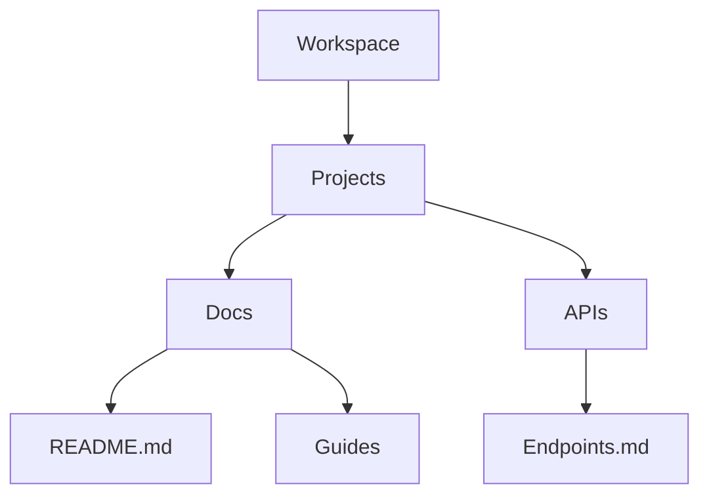

## Overview

Behruz Toshpulatov provides powerful tools to streamline your project documentation. You create, organize, collaborate, and track changes efficiently. Key features include intuitive document editing, flexible folder structures, real-time collaboration, and robust search with version history.

<Columns cols={3}>
  <Card title="Document Tools" icon="edit-3" href="#document-tools">
    Create and edit Markdown documents with live previews.
  </Card>
  <Card title="Organization" icon="folder" href="#organization">
    Build nested folder structures for scalable projects.
  </Card>
  <Card title="Collaboration" icon="users" href="#collaboration">
    Share docs securely with teams and external users.
  </Card>
</Columns>

## Document Creation and Editing Tools

Start new documents instantly. You access a rich Markdown editor with syntax highlighting, live previews, and auto-save. Embed images, code blocks, and diagrams directly.

<Steps>
  <Step title="Create Document" icon="plus">
    Click the `New Document` button in your workspace.
  </Step>
  <Step title="Edit Content" icon="edit">
    Use the split-view editor. Write Markdown on the left; preview renders on the right.
  </Step>
  <Step title="Add Media" icon="image">
    Drag-and-drop images or use the insert menu for code and embeds.
  </Step>
</Steps>

Here is a sample document structure you can replicate:

<CodeGroup tabs="Markdown,HTML">
  ```markdown
  # Project Overview

  ## Features
  - Real-time editing
  - Version control

  
  ```
  ```html
  <h1>Project Overview</h1>
  <h2>Features</h2>
  <ul>
    <li>Real-time editing</li>
    <li>Version control</li>
  </ul>
  
  ```
</CodeGroup>

<Callout kind="tip">
  Enable spell-check and auto-formatting in settings for faster editing.
</Callout>

## Folder Structures and Organization Methods

Organize projects with nested folders, tags, and custom hierarchies. You create unlimited subfolders for modular documentation.

| Method | Description | Best For |
|--------|-------------|----------|
| Nested Folders | Drag-and-drop to build trees | Large projects |
| Tags | Apply multiple labels per doc | Cross-referencing |
| Archives | Move inactive docs to hidden folders | Cleanup |



<Expandable title="Advanced Organization Tips" default-open="false">

Use search filters like `tag:api folder:docs` to locate files quickly. Integrate with Git for external repos.

</Expandable>

## Collaboration and Sharing Features

Invite team members for real-time editing or generate shareable links. Control permissions at folder or document level.

<Tabs>
  <Tab title="Team Invite" icon="users">
    <Steps>
      <Step title="Add Member">
        Go to workspace settings > Members > Invite by email.
      </Step>
      <Step title="Set Role">
        Choose Editor, Viewer, or Admin roles.
      </Step>
    </Steps>
  </Tab>
  <Tab title="Public Share" icon="share-2">
    Click Share > Generate link. Set expiration or password protection.
  </Tab>
  <Tab title="Embed" icon="code">
    Use embed code for external sites:

    ```html
    <iframe src="https://docs.example.com/embed/doc-id" width="100%" height="600"></iframe>
    ```
  </Tab>
</Tabs>

## Search and Version Control Basics

Search across all documents with full-text indexing. Filter by content, tags, or folders. View change history with diffs.

<Callout kind="info">
  Version control auto-saves every 30 seconds. Restore any version via the history panel.
</Callout>

To compare versions:

<CodeGroup>
  ```bash
  # Via CLI (if integrated)
  behruz diff doc-id v1.2 v1.3
  ```
  ```javascript
  // API example
  fetch('https://api.example.com/docs/doc-id/versions')
    .then(res => res.json())
    .then(versions => console.log(versions));
  ```
</CodeGroup>

<Columns cols={2}>
  <Card title="Next: Quickstart" icon="zap" href="/quickstart">
    Set up your first project.
  </Card>
  <Card title="Authentication" icon="shield" href="/authentication">
    Secure your workspace.
  </Card>
</Columns>